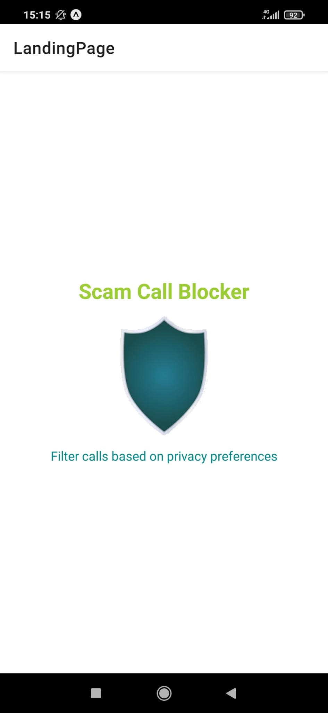
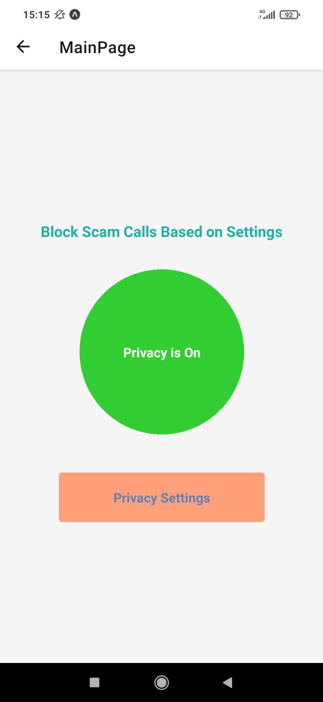
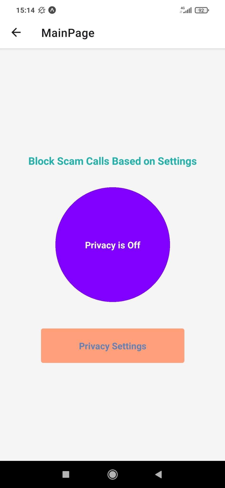
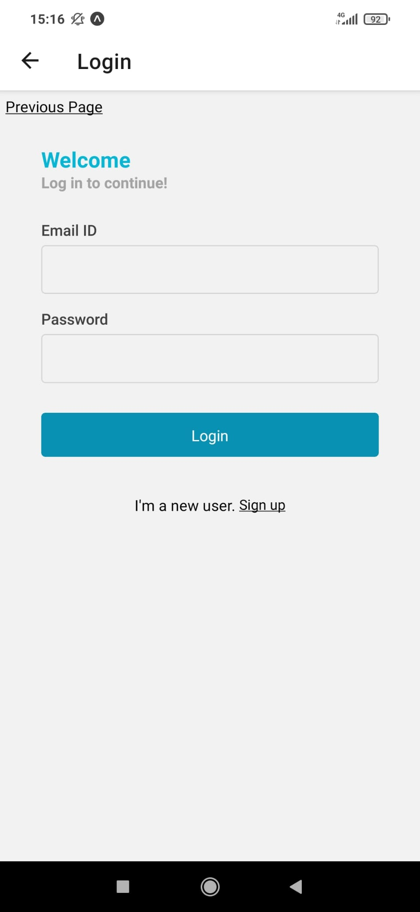
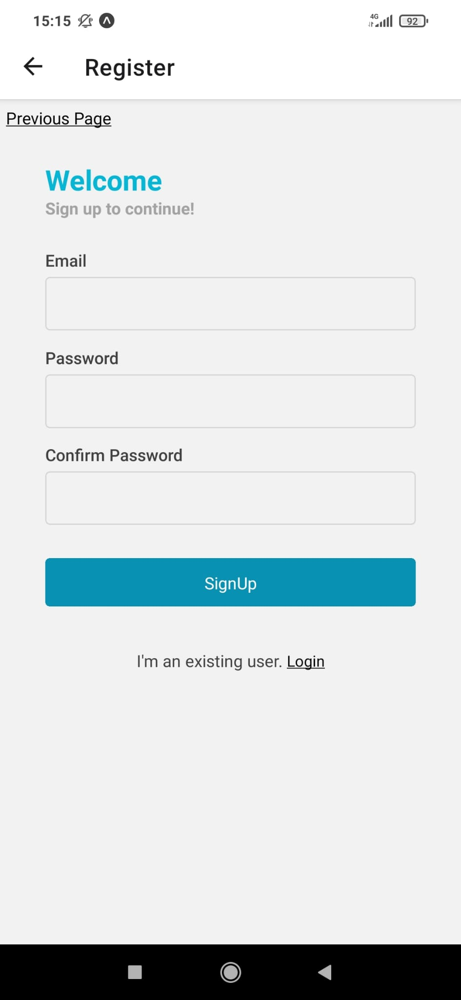
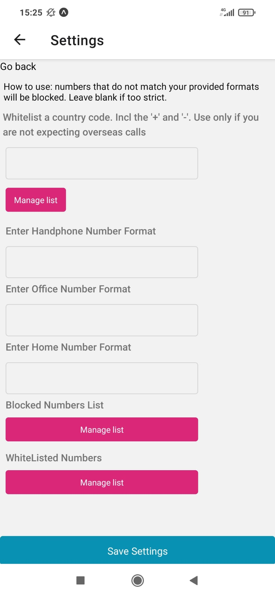
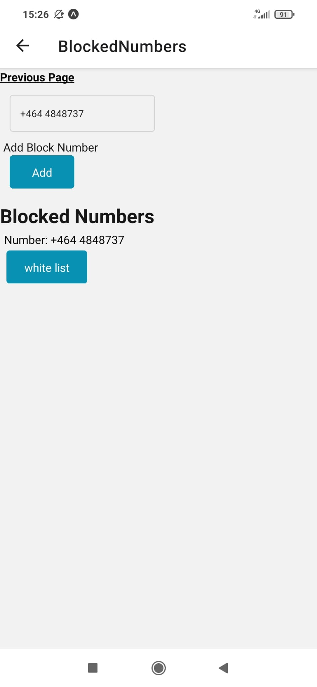
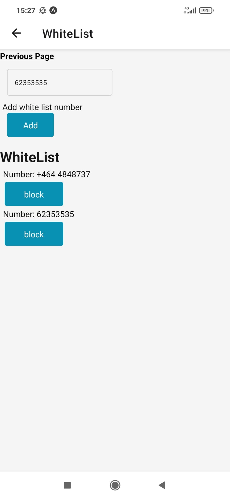

<h2> Scam Call Blocker Mockup </h2>

This app runs on Android. The app runs on free server and thus may lead to some waiting time between screens.

<h3> Steps to use app </h3>

Install Expo Go on Android phone from the app store.
Then enter the following url in the app or scan the below QR code.

<h5> Or if you would like to skip straight to viewing the app, scroll down to the "Design" Section below. </h5>

Expo QR Code here - Requires Expo App

Backend source codes can be accessed here: <a href="https://github.com/Kern000/projectTwoBackendServer"> Backend Project Two </a>

<h3> Project Description </h3>

This is 'Project Two' conducted at week 13 of Trent Global's Diploma in Web Application Development.

Project seeks to crystallize the learnings of React Frontend development, Express Backend, as well as Mongo Database manipulation. This project takes the requirements further and incorporates the use of React Native to construct an Android mobile application with the capabilities of firebase registration and login (but without token refresh).

This project, henceforth referred to as 'Scam Blocker', is a mockup project with full functionalities of CRUD, namely, Create, Read, Update, and Delete that is initiated on frontend, through a server that presents Restful API endpoints, to interact with a document-based database. Through these means, Scam Blocker forms the basis for a future scam blocking application and for other event driven applications (more on this below). To put it simply, the modus operandi of a completed application would use AppState management to manage an application's lifecycle and React Redux to create an action store for prescribed phone events.

Interestingly, a scam call blocker is commonly regarded as impossible due to the need to interact with phone functionality. As a result, this application provides a simple template, a white-label clone that anyone can easily adopt to build and test AppState management and actions on top of this clone, to try to solve this 'impossible' problem. Because if solved, scam calls can be filtered based on an individual's preferences and victimization by scam call centers can be prevented.

In my opinion, this problem can be tackled in a few directions:

1. Scam blocker can be incorporated at a telecommunications provider level, redirecting phone calls with suspicious call patterns, and using AI voice recognition to determine if a caller is likely to be a scammer from his/her opening sentences and voice-recordings.

2. Scam blocker can use packages like native call detection and 'nope' call blocker to redirect user to the block function built into the phone. However, there is little benefit in providing an app that has no preemptive blocking.

3. Scam blocker may record phone numbers marked by users as spam, pass it through an algorithm at telecommunications provider to determine if the number is indeed used for scam or other nefarious purposes, and block the number or monitor it before it is redirected to end-receivers. However, this may have privacy concerns if the call verification is performed by human beings.

4. This app may use push notifications to awaken the app during a call, and subsequently, push the call to the background.

Ultimately, the essence of this project as a white label application ready for event driven architecture, could hold many possibilities. Imagine a quantitative investment strategy that alerts you on the go when trading signals appear. Imagine a six-sigma production line that alerts you when issues are detected, just like how 'Andons' alert managers in the Toyota system. There are many possibilities to event driven applications as well as the information that is created, read, updated, and deleted in the process.

<h3> Target Audience </h3>
In the context of scam call blocker, anyone who find foreign scam call numbers a nuisance may adopt this app.

<h3> Technologies used </h3>

React native was explored, along with packages like navigation stack, async storage, orientation locker, and firebase authentication. During the early stages, android studio and virtual machine were used for testing purposes. Subsequently during development, react hooks were used to pursue functional programming, allowing for the use of efficient contexts as compared to the passing of props in traditional React object oriented programming.

<h3> Design </h3>

Simple colors and backgrounds were used for easy customizability as this was meant as a white label application. Users may use this frontend and backend template to conduct simple adaptation in an almost plug and play manner for their event driven application.

<h3> Key Capabilities Tested </h3>

1. There is FrontEnd regex validation for all input fields to prevent XSS injections. Mongoose (MongoDB) schema perform backend validation to prevent unwanted and bad datasets from impairing data usage. Joi middleware perform validation on all post requests at the controller level. Error messages on the frontend communicates user error and guides users to take corrective actions.

2. Stack navigator stacks screens based on user paths to prevent unnecessary unmounting and re-rendering of screens. While mounting many screens could lead to stack overflow, the page flow is designed to limit the maximum number of stacks even when using deeply nested pages.

3. There is real time update to the frontend user from the database with regard to their lists of blocked number, whitelisted country codes, and whitelisted numbers. Optional chaining of the .map function is also employed to give flexibility in the rendering the reloaded data. This is because the data fetching is not instantaneous, therefore, react has to give time before rendering.

4. Landing page communicates the clear purpose of the App and navigates to the main page after a short period of time or if the user presses on the screen.

5. Backend server is separated into the schema layer, service layer (includes the Data Access Layer), controller layer for sending http responses and data for frontend use, router layer, and middleware for firebase authorization based on Json web token. All these lead to better abstraction and separation of concerns and code reuseability.

6. Both referencing and embedding structure is incorporated in MongoDB. User document is linked to data entry documents, which may contain lightly nested arrays. This structure allows sharding and adaptation to different user needs based on their entries. This allows for fast retrieval of data as documents can be indexed based on their users rather than the data entry fields which may be large in numbers. These allow horizontal scalability without sacrificing the app's performance.

<h3> Test Cases </h3>
Test Name: Register email and password  
Test case: key in a valid email format ("XXXX"@"mail".com) and password and submit.  
Expected outcome: Registration should be successful and user automatically logged in and sent to "settings" page.   

Test Name: Login email and password  
Test case: key in a valid email format ("XXXX"@"mail".com) and password and submit.  
Expected outcome: Login should be successful and user is redirected to the settings page.  

Test Name: Blocking and whitelist numbers  
Test case: key in a phone number in the block number text box in the 'manage blocked numbers' page and submit.  
Expected outcome: The number keyed in should appear with the rest of the 'blocked' numbers.  

<h3> Limitations </h3>

1. AppState management and redux have not been incorporated to manage Application Life cycle. This means that the app only performs its function when it is active on the phone, but not when it is in the background, suspended, or when inactive. The actual blocking capability has not been implemented.

2. Firebase token refresh has not been incorporated. This is a major shortcoming as tokens only last for an hour and if the phone is incompatible with async storage, it would not be able to store the token. Future versions would have to incorporate token refresh so that users would not have to keep registering accounts. As such, the current state of the app would largely be used for testing and exploratory purposes.

3. Third, multiple axios calls are made during data entry and update in the 'settings' screen. This can be streamlined through amalgamation. Having multiple axios calls may lead to performance implications.

<h3> Summary </h3>

In summary, Scam blocker is a react native application designed for future purposes of appState management and event driven API. While currently purposed for the addition of call blocking capabilities, it is designed for easy adaptation into other event driven applications, and furthermore, horizontal scalability.

<h3> Credits to external assets </h3>

Special thanks to Freepik for shield icon logo
